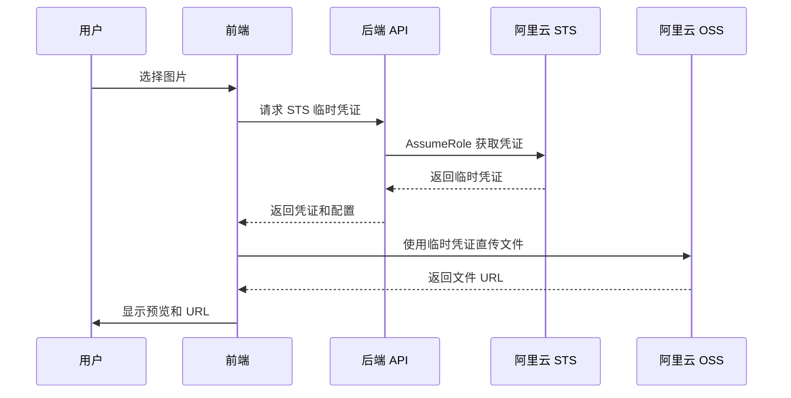

# 阿里云 OSS STS 图片上传集成文档

本文档详细说明了如何在 Next.js 项目中集成阿里云 OSS STS 临时凭证图片直传功能。

## 📋 目录

- [功能概述](#功能概述)
- [技术架构](#技术架构)
- [前置准备](#前置准备)
- [安装依赖](#安装依赖)
- [环境变量配置](#环境变量配置)
- [代码实现](#代码实现)
- [阿里云配置](#阿里云配置)
- [使用说明](#使用说明)
- [常见问题](#常见问题)

---

## 功能概述

### 实现目标
实现用户在管理后台直接上传图片到阿里云 OSS,无需手动输入 URL。

### 核心特性
- ✅ 前端直传 OSS (不经过服务器)
- ✅ STS 临时凭证安全认证
- ✅ 实时上传进度显示
- ✅ 拖拽/点击上传支持
- ✅ 图片预览功能
- ✅ 文件类型和大小验证
- ✅ 集成 React Hook Form

---

## 技术架构

### 工作流程



### 技术栈
- **前端**: React Hook Form + ali-oss SDK
- **后端**: Next.js API Routes + ali-oss STS
- **存储**: 阿里云 OSS
- **安全**: STS 临时凭证 (1小时有效期)

---

## 前置准备

### 阿里云账号准备

#### 1. 创建 RAM 用户
登录阿里云控制台 → 访问控制(RAM) → 用户

1. 创建新用户,勾选 **OpenAPI 调用访问**
2. 保存 AccessKey ID 和 AccessKey Secret
3. 为用户添加权限: `AliyunSTSAssumeRoleAccess`

#### 2. 创建 RAM 角色
访问控制(RAM) → 角色

1. 创建角色,选择 **阿里云账号**
2. 受信实体为当前账号
3. 为角色添加权限: `AliyunOSSFullAccess`
4. 记录角色 ARN: `acs:ram::账号ID:role/角色名`

#### 3. 创建 OSS Bucket
对象存储 OSS → Bucket 列表

1. 创建新 Bucket
2. 读写权限: **公共读**
3. 记录 Bucket 名称和区域

#### 4. 配置 CORS 规则
Bucket 详情 → 权限管理 → 跨域设置

```json
{
  "来源 Sources": "*",
  "允许 Methods": ["GET", "POST", "PUT", "DELETE", "HEAD"],
  "允许 Headers": "*",
  "暴露 Headers": ["ETag", "x-oss-request-id"],
  "缓存时间": 3600
}
```

**生产环境建议**:
- 来源设置为具体域名: `https://your-domain.com, http://localhost:3006`

---

## 安装依赖

```bash
cd template-store
npm install ali-oss
```

---

## 环境变量配置

### 1. 更新 `.env.example`

在 `.env.example` 中添加以下配置:

```env
# 阿里云 OSS 配置 - 用于图片上传
# OSS 区域（例如：oss-cn-hangzhou, oss-cn-beijing）
ALIYUN_OSS_REGION="oss-cn-beijing"
# OSS Bucket 名称
ALIYUN_OSS_BUCKET="your-bucket-name"
# 阿里云 AccessKey ID (RAM 用户)
ALIYUN_OSS_ACCESS_KEY_ID="your-access-key-id"
# 阿里云 AccessKey Secret (RAM 用户)
ALIYUN_OSS_ACCESS_KEY_SECRET="your-access-key-secret"
# RAM 角色 ARN（用于 STS 临时凭证，格式：acs:ram::账号ID:role/角色名）
ALIYUN_OSS_RAM_ROLE_ARN="acs:ram::123456789:role/AliyunOSSUploadRole"
# OSS 访问域名（可选，留空使用默认域名）
ALIYUN_OSS_ENDPOINT=""
```

### 2. 配置 `.env`

复制 `.env.example` 并填入实际值:

```bash
cp .env.example .env
```

**重要提示**:
- `ALIYUN_OSS_ENDPOINT` 留空,让 SDK 自动生成
- 使用 RAM 用户的 AccessKey,不要使用主账号
- AccessKey ID 应以 `LTAI` 开头

---

## 代码实现

### 1. 类型定义

创建 `types/oss.ts`:

```typescript
/**
 * 阿里云 OSS STS 相关类型定义
 */

/**
 * STS 临时凭证
 */
export interface STSCredentials {
  /** 临时访问密钥 ID */
  accessKeyId: string
  /** 临时访问密钥 Secret */
  accessKeySecret: string
  /** 安全令牌 */
  securityToken: string
  /** 凭证过期时间 */
  expiration: string
}

/**
 * STS API 响应
 */
export interface STSResponse {
  /** 是否成功 */
  success: boolean
  /** STS 凭证 */
  credentials?: STSCredentials
  /** OSS 配置信息 */
  ossConfig?: {
    /** OSS 区域 */
    region: string
    /** Bucket 名称 */
    bucket: string
    /** 自定义域名（可选） */
    endpoint?: string
  }
  /** 错误信息 */
  error?: string
}

/**
 * 文件上传配置
 */
export interface UploadConfig {
  /** 文件对象 */
  file: File
  /** 存储路径前缀 */
  pathPrefix?: string
  /** 上传进度回调 */
  onProgress?: (percent: number) => void
}

/**
 * 文件上传结果
 */
export interface UploadResult {
  /** 是否成功 */
  success: boolean
  /** 文件访问 URL */
  url?: string
  /** 文件名 */
  fileName?: string
  /** 错误信息 */
  error?: string
}
```

### 2. 后端 STS API

创建 `app/api/admin/oss/sts/route.ts`:

```typescript
import { NextRequest, NextResponse } from 'next/server'
import { requireAdminSession } from '@/lib/auth'
import OSS from 'ali-oss'
import type { STSResponse } from '@/types/oss'

// STS 凭证有效期（秒）
const STS_DURATION_SECONDS = 3600

export async function GET(request: NextRequest) {
  // 验证管理员权限
  const authError = await requireAdminSession(request)
  if (authError) {
    return authError
  }

  try {
    const {
      ALIYUN_OSS_ACCESS_KEY_ID,
      ALIYUN_OSS_ACCESS_KEY_SECRET,
      ALIYUN_OSS_RAM_ROLE_ARN,
      ALIYUN_OSS_REGION,
      ALIYUN_OSS_BUCKET,
      ALIYUN_OSS_ENDPOINT,
    } = process.env

    // 验证必需的环境变量
    if (!ALIYUN_OSS_ACCESS_KEY_ID || !ALIYUN_OSS_ACCESS_KEY_SECRET ||
        !ALIYUN_OSS_RAM_ROLE_ARN || !ALIYUN_OSS_REGION || !ALIYUN_OSS_BUCKET) {
      return NextResponse.json({
        success: false,
        error: 'OSS 配置不完整',
      } as STSResponse, { status: 500 })
    }

    // 使用 ali-oss 的 STS 客户端
    const { STS } = OSS
    const sts = new STS({
      accessKeyId: ALIYUN_OSS_ACCESS_KEY_ID,
      accessKeySecret: ALIYUN_OSS_ACCESS_KEY_SECRET,
    })

    // 生成会话名称
    const roleSessionName = `oss-upload-${Date.now()}-${Math.random().toString(36).substr(2, 9)}`

    // 调用 AssumeRole 获取临时凭证
    const assumeRoleResponse = await sts.assumeRole(
      ALIYUN_OSS_RAM_ROLE_ARN,
      '',  // policy 传空字符串使用角色全部权限
      STS_DURATION_SECONDS,
      roleSessionName
    )

    const credentials = assumeRoleResponse.credentials

    if (!credentials) {
      throw new Error('获取 STS 凭证失败')
    }

    // 返回凭证和 OSS 配置
    const response: STSResponse = {
      success: true,
      credentials: {
        accessKeyId: credentials.AccessKeyId,
        accessKeySecret: credentials.AccessKeySecret,
        securityToken: credentials.SecurityToken,
        expiration: credentials.Expiration,
      },
      ossConfig: {
        region: ALIYUN_OSS_REGION,
        bucket: ALIYUN_OSS_BUCKET,
        endpoint: ALIYUN_OSS_ENDPOINT,
      },
    }

    return NextResponse.json(response)
  } catch (error) {
    console.error('获取 STS 凭证失败:', error)
    return NextResponse.json({
      success: false,
      error: error instanceof Error ? error.message : '获取上传凭证失败',
    } as STSResponse, { status: 500 })
  }
}
```

### 3. 前端上传工具

创建 `lib/oss-client.ts`:

```typescript
import OSS from 'ali-oss'
import type { STSResponse, UploadConfig, UploadResult } from '@/types/oss'

/**
 * 生成唯一文件名
 */
function generateUniqueFileName(originalName: string): string {
  const timestamp = Date.now()
  const random = Math.random().toString(36).substring(2, 8)
  const ext = originalName.split('.').pop()?.toLowerCase() || 'jpg'
  return `${timestamp}-${random}.${ext}`
}

/**
 * 获取 STS 临时凭证
 */
export async function getSTSCredentials(): Promise<STSResponse> {
  try {
    const response = await fetch('/api/admin/oss/sts', {
      method: 'GET',
      credentials: 'include',
    })

    if (!response.ok) {
      const error = await response.json()
      throw new Error(error.error || '获取上传凭证失败')
    }

    return await response.json()
  } catch (error) {
    return {
      success: false,
      error: error instanceof Error ? error.message : '获取上传凭证失败',
    }
  }
}

/**
 * 创建 OSS 客户端
 */
function createOSSClient(stsResponse: STSResponse): OSS | null {
  if (!stsResponse.success || !stsResponse.credentials || !stsResponse.ossConfig) {
    return null
  }

  const { credentials, ossConfig } = stsResponse

  const ossClientConfig: any = {
    region: ossConfig.region,
    accessKeyId: credentials.accessKeyId,
    accessKeySecret: credentials.accessKeySecret,
    stsToken: credentials.securityToken,
    bucket: ossConfig.bucket,
    timeout: 60000,
  }

  // 智能处理 endpoint,避免 bucket 名称重复
  if (ossConfig.endpoint) {
    const endpoint = ossConfig.endpoint.replace(/\/$/, '')
    if (endpoint.includes(ossConfig.bucket)) {
      ossClientConfig.endpoint = endpoint.replace(`${ossConfig.bucket}.`, '')
    } else {
      ossClientConfig.endpoint = endpoint
    }
  }

  return new OSS(ossClientConfig)
}

/**
 * 上传文件到 OSS
 */
export async function uploadToOSS(config: UploadConfig): Promise<UploadResult> {
  const { file, pathPrefix = 'covers/', onProgress } = config

  try {
    // 1. 获取 STS 凭证
    const stsResponse = await getSTSCredentials()
    if (!stsResponse.success) {
      return {
        success: false,
        error: stsResponse.error || '获取上传凭证失败',
      }
    }

    // 2. 创建 OSS 客户端
    const client = createOSSClient(stsResponse)
    if (!client) {
      return {
        success: false,
        error: '创建 OSS 客户端失败',
      }
    }

    // 3. 生成唯一文件名
    const fileName = generateUniqueFileName(file.name)
    const objectKey = `${pathPrefix}${fileName}`

    // 4. 上传文件
    const result = await client.put(objectKey, file, {
      headers: {
        'x-oss-object-acl': 'public-read',
        'Content-Type': file.type,
      },
      ...(onProgress && {
        progress: (p: number) => {
          const percent = Math.floor(p * 100)
          onProgress(percent)
        },
      }),
    } as any)

    // 5. 返回访问 URL
    let url = result.url
    url = url.replace(/^http:/, 'https:')

    return {
      success: true,
      url,
      fileName,
    }
  } catch (error) {
    console.error('上传文件失败:', error)
    return {
      success: false,
      error: error instanceof Error ? error.message : '上传失败',
    }
  }
}

/**
 * 验证图片文件
 */
export function validateImageFile(file: File): { valid: boolean; error?: string } {
  const allowedTypes = ['image/jpeg', 'image/jpg', 'image/png', 'image/webp', 'image/gif']

  if (!allowedTypes.includes(file.type)) {
    return {
      valid: false,
      error: '只支持 JPG、PNG、WebP、GIF 格式的图片',
    }
  }

  const maxSize = 5 * 1024 * 1024  // 5MB
  if (file.size > maxSize) {
    return {
      valid: false,
      error: '图片大小不能超过 5MB',
    }
  }

  return { valid: true }
}
```

### 4. 图片上传组件

创建 `components/admin/ImageUpload.tsx`:

```typescript
'use client'

import { useState, useRef, DragEvent } from 'react'
import Image from 'next/image'
import { uploadToOSS, validateImageFile } from '@/lib/oss-client'

interface ImageUploadProps {
  value?: string
  onChange: (url: string) => void
  onError?: (error: string) => void
}

export function ImageUpload({ value, onChange, onError }: ImageUploadProps) {
  const [uploading, setUploading] = useState(false)
  const [progress, setProgress] = useState(0)
  const [dragOver, setDragOver] = useState(false)
  const [previewUrl, setPreviewUrl] = useState(value || '')
  const fileInputRef = useRef<HTMLInputElement>(null)

  const handleFileUpload = async (file: File) => {
    // 验证文件
    const validation = validateImageFile(file)
    if (!validation.valid) {
      onError?.(validation.error || '文件验证失败')
      return
    }

    try {
      setUploading(true)
      setProgress(0)

      // 上传到 OSS
      const result = await uploadToOSS({
        file,
        pathPrefix: 'covers/',
        onProgress: (percent) => {
          setProgress(percent)
        },
      })

      if (!result.success || !result.url) {
        throw new Error(result.error || '上传失败')
      }

      setPreviewUrl(result.url)
      onChange(result.url)
    } catch (error) {
      const errorMessage = error instanceof Error ? error.message : '上传失败'
      onError?.(errorMessage)
    } finally {
      setUploading(false)
      setProgress(0)
    }
  }

  const handleFileChange = (e: React.ChangeEvent<HTMLInputElement>) => {
    const file = e.target.files?.[0]
    if (file) {
      handleFileUpload(file)
    }
  }

  const handleDragOver = (e: DragEvent<HTMLDivElement>) => {
    e.preventDefault()
    setDragOver(true)
  }

  const handleDragLeave = (e: DragEvent<HTMLDivElement>) => {
    e.preventDefault()
    setDragOver(false)
  }

  const handleDrop = (e: DragEvent<HTMLDivElement>) => {
    e.preventDefault()
    setDragOver(false)
    const file = e.dataTransfer.files?.[0]
    if (file && file.type.startsWith('image/')) {
      handleFileUpload(file)
    }
  }

  const handleClick = () => {
    if (!uploading) {
      fileInputRef.current?.click()
    }
  }

  const handleRemove = (e: React.MouseEvent) => {
    e.stopPropagation()
    setPreviewUrl('')
    onChange('')
    if (fileInputRef.current) {
      fileInputRef.current.value = ''
    }
  }

  return (
    <div className="space-y-2">
      <div
        className={`
          relative border-2 border-dashed rounded-lg overflow-hidden
          transition-all duration-200 cursor-pointer
          ${dragOver ? 'border-blue-500 bg-blue-50' : 'border-gray-300 hover:border-gray-400'}
          ${uploading ? 'pointer-events-none' : ''}
        `}
        onDragOver={handleDragOver}
        onDragLeave={handleDragLeave}
        onDrop={handleDrop}
        onClick={handleClick}
      >
        {previewUrl ? (
          <div className="relative w-full h-64 group">
            <Image
              src={previewUrl}
              alt="预览图"
              fill
              className="object-cover"
              unoptimized
            />
            {!uploading && (
              <div className="absolute inset-0 bg-black/50 opacity-0 group-hover:opacity-100 transition-opacity flex items-center justify-center">
                <button
                  type="button"
                  onClick={handleRemove}
                  className="bg-red-500 text-white px-4 py-2 rounded-lg hover:bg-red-600 transition-colors"
                >
                  删除图片
                </button>
              </div>
            )}
            {uploading && (
              <div className="absolute inset-0 bg-black/70 flex items-center justify-center">
                <div className="text-center text-white">
                  <div className="text-lg font-medium mb-2">上传中...</div>
                  <div className="text-3xl font-bold">{progress}%</div>
                </div>
              </div>
            )}
          </div>
        ) : (
          <div className="h-64 flex flex-col items-center justify-center text-gray-500 p-6">
            {uploading ? (
              <div className="text-center">
                <div className="mb-4">
                  <svg className="animate-spin h-12 w-12 mx-auto text-blue-500" xmlns="http://www.w3.org/2000/svg" fill="none" viewBox="0 0 24 24">
                    <circle className="opacity-25" cx="12" cy="12" r="10" stroke="currentColor" strokeWidth="4" />
                    <path className="opacity-75" fill="currentColor" d="M4 12a8 8 0 018-8V0C5.373 0 0 5.373 0 12h4zm2 5.291A7.962 7.962 0 014 12H0c0 3.042 1.135 5.824 3 7.938l3-2.647z" />
                  </svg>
                </div>
                <div className="text-lg font-medium text-gray-700 mb-2">上传中...</div>
                <div className="text-2xl font-bold text-blue-500">{progress}%</div>
              </div>
            ) : (
              <>
                <svg className="w-16 h-16 mb-4" fill="none" stroke="currentColor" viewBox="0 0 24 24">
                  <path strokeLinecap="round" strokeLinejoin="round" strokeWidth={2} d="M7 16a4 4 0 01-.88-7.903A5 5 0 1115.9 6L16 6a5 5 0 011 9.9M15 13l-3-3m0 0l-3 3m3-3v12" />
                </svg>
                <p className="text-lg font-medium mb-2">点击上传或拖拽图片到此处</p>
                <p className="text-sm text-gray-400">支持 JPG、PNG、WebP、GIF 格式，大小不超过 5MB</p>
              </>
            )}
          </div>
        )}
      </div>

      <input
        ref={fileInputRef}
        type="file"
        accept="image/jpeg,image/jpg,image/png,image/webp,image/gif"
        onChange={handleFileChange}
        className="hidden"
      />

      {previewUrl && !uploading && (
        <p className="text-sm text-gray-500">点击图片可重新上传</p>
      )}
    </div>
  )
}
```

### 5. 集成到表单

在 `components/admin/TemplateForm.tsx` 中使用:

```typescript
import { Controller } from 'react-hook-form'
import { ImageUpload } from './ImageUpload'

// 在表单中使用
<Controller
  name="coverUrl"
  control={control}
  render={({ field }) => (
    <ImageUpload
      value={field.value}
      onChange={(url) => {
        field.onChange(url)
        clearErrors('coverUrl')
      }}
      onError={(error) => {
        setError('coverUrl', {
          type: 'manual',
          message: error,
        })
      }}
    />
  )}
/>
```

---

## 阿里云配置

### RAM 用户权限策略

确保 RAM 用户有以下权限:

```json
{
  "Version": "1",
  "Statement": [
    {
      "Effect": "Allow",
      "Action": "sts:AssumeRole",
      "Resource": "*"
    }
  ]
}
```

### RAM 角色信任策略

```json
{
  "Statement": [
    {
      "Action": "sts:AssumeRole",
      "Effect": "Allow",
      "Principal": {
        "RAM": [
          "acs:ram::你的账号ID:root"
        ]
      }
    }
  ],
  "Version": "1"
}
```

### RAM 角色权限策略

```json
{
  "Version": "1",
  "Statement": [
    {
      "Effect": "Allow",
      "Action": [
        "oss:PutObject",
        "oss:GetObject"
      ],
      "Resource": [
        "acs:oss:*:*:your-bucket-name/*"
      ]
    }
  ]
}
```

---

## 使用说明

### 开发环境

1. **配置环境变量**
   ```bash
   cp .env.example .env
   # 编辑 .env 填入阿里云配置
   ```

2. **启动开发服务器**
   ```bash
   npm run dev
   ```

3. **访问管理后台**
   ```
   http://localhost:3006/admin/templates/new
   ```

4. **上传图片**
   - 点击上传区域选择图片
   - 或拖拽图片到上传区域
   - 查看上传进度
   - 上传成功后自动填充 URL

### 生产环境

1. **更新环境变量**
   - 使用生产环境的 OSS 配置
   - 更新 CORS 配置为生产域名

2. **构建部署**
   ```bash
   npm run build
   npm start
   ```

---

## 常见问题

### 1. CORS 跨域错误

**错误信息**:
```
Access to XMLHttpRequest has been blocked by CORS policy
```

**解决方案**:
在阿里云 OSS Bucket 的跨域设置中添加 CORS 规则。

### 2. AccessDenied 错误

**错误信息**:
```
<Code>AccessDenied</Code>
<Message>The bucket you are attempting to access must be addressed using the specified endpoint</Message>
```

**解决方案**:
检查 `ALIYUN_OSS_REGION` 和 `ALIYUN_OSS_BUCKET` 配置是否正确。

### 3. URL 地址重复 bucket 名称

**错误信息**:
```
https://wangcoco.wangcoco.oss-cn-beijing.aliyuncs.com/...
```

**解决方案**:
将 `ALIYUN_OSS_ENDPOINT` 留空,让 SDK 自动处理。

### 4. NoPermission 错误

**错误信息**:
```
没有权限执行此操作
```

**解决方案**:
- 确认 RAM 用户有 `AliyunSTSAssumeRoleAccess` 权限
- 确认角色信任策略包含当前账号
- 确认使用的是 RAM 用户的 AccessKey,不是主账号

### 5. 文件上传失败

**检查清单**:
- [ ] 文件类型是否支持 (JPG/PNG/WebP/GIF)
- [ ] 文件大小是否超过 5MB
- [ ] 网络连接是否正常
- [ ] STS 凭证是否过期
- [ ] OSS Bucket 权限是否正确

---

## 安全建议

### 生产环境

1. **使用 HTTPS**
   - 强制使用 HTTPS 协议
   - 配置 SSL 证书

2. **限制 CORS 来源**
   ```
   允许来源: https://your-domain.com
   ```

3. **定期轮换密钥**
   - 定期更换 AccessKey
   - 使用密钥管理服务

4. **监控和审计**
   - 开启 OSS 访问日志
   - 监控异常上传行为

5. **文件验证**
   - 验证文件类型和大小
   - 检查文件内容(防病毒)

---

## 文件结构

```
template-store/
├── types/
│   └── oss.ts                    # OSS 类型定义
├── lib/
│   └── oss-client.ts             # OSS 客户端工具
├── app/
│   └── api/
│       └── admin/
│           └── oss/
│               └── sts/
│                   └── route.ts  # STS API
├── components/
│   └── admin/
│       ├── ImageUpload.tsx       # 图片上传组件
│       └── TemplateForm.tsx      # 表单集成
├── .env.example                  # 环境变量示例
└── .env                          # 环境变量配置
```

---

## 参考资源

- [阿里云 OSS 文档](https://help.aliyun.com/product/31815.html)
- [阿里云 STS 文档](https://help.aliyun.com/product/28638.html)
- [ali-oss SDK](https://github.com/ali-sdk/ali-oss)
- [RAM 权限管理](https://help.aliyun.com/product/28625.html)

---

## 更新日志

### v1.0.0 (2025-10-02)
- ✅ 初始版本
- ✅ 实现 STS 临时凭证获取
- ✅ 实现前端直传 OSS
- ✅ 集成图片上传组件
- ✅ 支持拖拽和进度显示

---

## 维护者

如有问题,请联系技术团队。

---

**最后更新**: 2025-10-02
